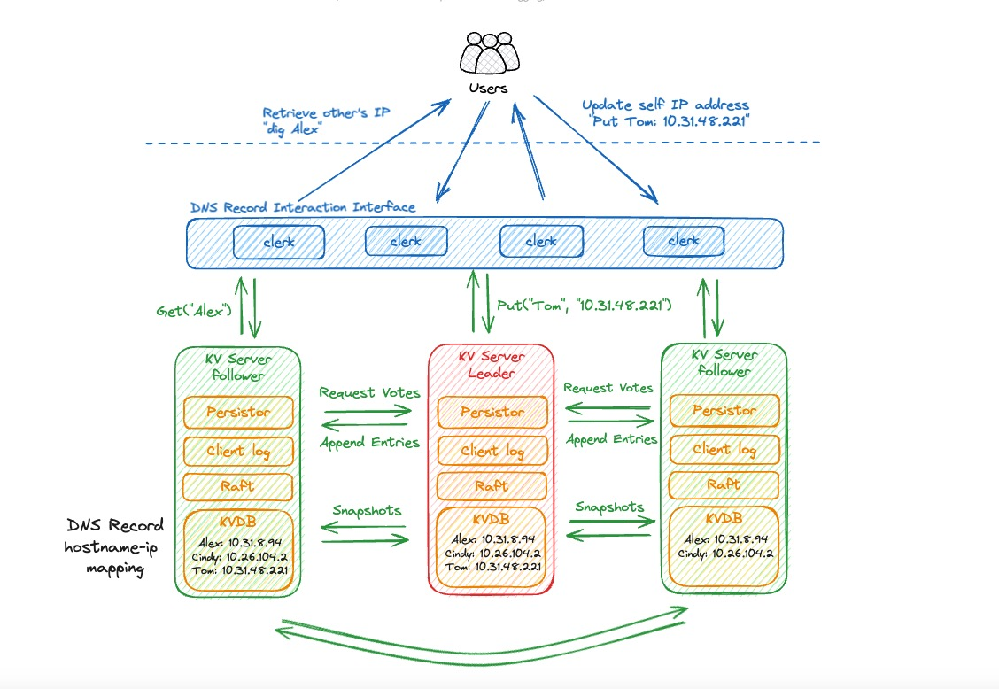
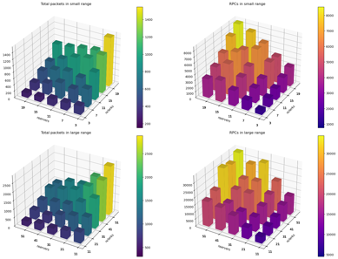
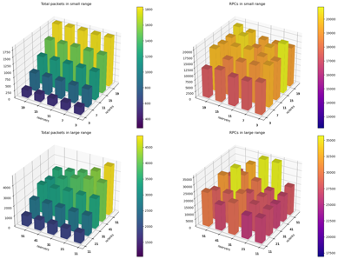
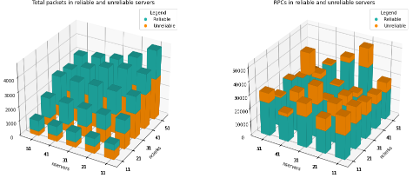
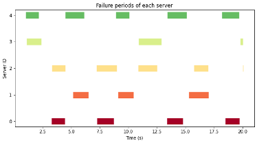

# MyDNS
A dynamic third-party DNS service based on distributed KV store
---

Group Project for CSC4303, 2024 Spring at CUHK-Shenzhen 

## Introduction
"MyDNS" is a dynamic third-party DNS service tailored to address the connectivity challenges experienced in environments with dynamic IP address allocations, such as the CUHK-Shenzhen Campus Network. One significant issue we've identified is the lack of inter-domain DNS services within the current local network infrastructure. When the machines reboot, for example, their IP addresses may change, disrupting access to essential services like Remote Desktop, SSH, or WebUI for Stable Diffusion and LLMs.

MyDNS will seamlessly update and share IP addresses in real-time, ensuring that their users maintain uninterrupted access to those networked services. To guarantee the reliability and stability of MyDNS, we are implementing a KV store service fortified by the Raft consensus algorithm. This robust infrastructure is designed to ensure that MyDNS not only addresses the immediate challenges of dynamic IP management but also delivers a consistently high-quality user experience.

## Architecture


Core Parts in `src/`:

+ `raft`: A module inside the raft server. Using the Raft strong consistency algorithm to make replicas.

+ `raftkv`: KV Server to store hostname-ip mapping. During a term, there will be only one KV server as the leader nodes, handling all PUT and GET requests. Servers communicate with each other through RPC calls by `labrpc`.

+ `main.go`: The main entry of the DNS server program. Includes clerk working routines that reads and writes the KVServer and responds to requests from clients.

+ `ClientProgram`: The user-side client program, which could uploading local hostname and corresponding IP address to the MyDNS server. Also it can be used to make queries. 

+ `client_tests`: This includes a correctness test and a flood test to test the system performance. The correctness test lets 5 clients to upload different hostname-ip mapping and later read by random clients (Probably not the client who uploaded it). The flood test keep sending query or put requests by random. Total received packets are recorded at both client side and server side to measure the loss packet rate. Users can make server crashes to see how results might change by making `crash=true` through passing the argument into the program. 

## Run
+ To start the server:

```sh
cd src/
sh run_dns.sh
```
You may edit some start-up arguments in the `run_dns.sh`.

```sh
go run main.go \
    --nservers 5 \       # Number of KV servers
    --nclerks 5 \        # Number of Interface clerks
    --dnsDuration 100 \  # The DNS working durations
    --crash \            # Set the flag to simulate server crashes
    --unreliable \       # Set the flag to simulate unreliable networks
```

+ User-side program

While the service is running, use the `ClientProgram/mydns.py` for multiple functions:

```sh
cd ClientProgram/

# Run the client, execute background ip update routines
python mydns.py update

# Run the client, query for hostnames
python mydns.py query <hostname1> <hostname2> ...

# Run the client, query for DNS server's ips:
python mydns.py dnsip
```

Alternatively, you may also use `dig` command to send QUERY:

```py
dig @127.0.0.1 -p 9876 <hostname>
```

+ Tester

While the service is running, use `client_tests/put.query` or `client_tests/query.py` to send PUT/QUERY requests:

```sh
python client_tests/put.py
python client_tests/query.py
```

Run the following command to start the flood test:

```sh
python client_tests/flood_test.py
```

Run the following command to start a comprehensive flood test on different parameters:

```sh
python client_tests/flood_test_grid.py
```

Run the following command to start the correctness check. Note that `--nclients` argument should be consistent with DNS server's `--nclerks` argument.

```sh
python client_tests/correctness_test.py
```

## Experiment Analysis

To evaluate the performance and reliability of the MyDNS system, we conducted the following experiments:

### 1. **Flood Test**
#### Objective
Simulate high-load conditions to test RPC communication and packet handling capabilities.

#### Experimental Setup
- Send a large number of PUT and QUERY packets to the client within 10 seconds.
- Parameters:
  - Network conditions: `unreliable = [True, False]`
  - Number of servers (`nservers`): `[3, 5, 7, 9, 11, 13, 15, 17, 19]` (small range) and `[11, 21, 31, 41, 51]` (large range)
  - Number of clients (`nclerks`): Same ranges as the servers.

#### Results Analysis
- **Unreliable Network**:
  - Total packets decrease as the number of servers increases but increase with the number of clients.
  - RPCs increase with both the number of servers and clients.
  - More servers lead to fewer total packets, indicating better efficiency.
  
- **Reliable Network**:
  - Total packets increase as the number of clients increases.
  - RPCs increase with both the number of servers and clients.
  - Total packets remain relatively consistent regardless of the number of servers.
  

### 2. **Reliable vs. Unreliable Network**
- Total packets are always higher in a reliable network compared to an unreliable network.
- RPCs are consistently higher in an unreliable network compared to a reliable network.
  

### 3. **Correctness Test**
#### Objective
Verify system correctness when servers crash.

#### Experimental Setup
- Send 100 PUT and QUERY packets.
- Simulate server crashes with `crash = [True, False]`.

#### Results Analysis
- When `crash = True`, servers randomly shut down (ensuring fewer than half are down at any given time).
- The system consistently provides correct responses:
  - **Expected messages**: All messages are successfully received.
  - **Address validation**: Local address pairs and remote address pairs are identical.

  


