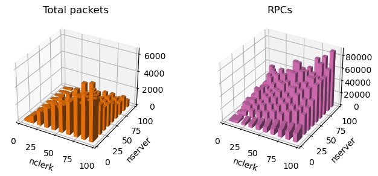

# MyDNS
a dynamic third-party DNS service based on distributed KV store
---
## Introduction:
"MyDNS" is a dynamic third-party DNS service tailored to address the connectivity challenges experienced in environments with dynamic IP address allocations, such as the CUHK-Shenzhen Campus Network. One significant issue we've identified is the lack of inter-domain DNS services within the current local network infrastructure. When the machines reboot, for example, their IP addresses may change, disrupting access to essential services like Remote Desktop, SSH, or WebUI for Stable Diffusion and LLMs.

MyDNS will seamlessly update and share IP addresses in real-time, ensuring that their users maintain uninterrupted access to those networked services. To guarantee the reliability and stability of MyDNS, we are implementing a KV store service fortified by the Raft consensus algorithm. This robust infrastructure is designed to ensure that MyDNS not only addresses the immediate challenges of dynamic IP management but also delivers a consistently high-quality user experience.

## Architecture


  - Core Parts:
      `raft`: A module inside the raft server. Using the Raft strong consistency algorithm to make replicas.
      `raftkv`: KV Server to store hostname-ip mapping. During a term, there will be only one KV server as the leader nodes, handling all PUT and GET requests. Servers communicate with each other through RPC calls.
      `main.go`: The service layer reads and writes the KVServer and responds to requests from clients.
      `ClientProgram`: The client side program to keep uploading local hostname and corresponding IP address to the running backend service.
      `client_tests`: We includes a correctness test and a flood test to test the system performance. The correctness test lets 5 clients to upload different hostname-ip mapping and later read by random clients (Probably not the client who uploaded it). The flood test keep sending query or put requests by random. Total received packets are recorded at both client side and server side to measure the loss packet rate. Users can make server crashes to see how results might change by making `crash=true` through passing the argument into the program. 

## Run
To start server:
```
  sh run_dns.sh
```
In another terminal, use `put.query` or `query.py` to send requests.
```
  python put.py # python query.py
```
Modify the config:
```
go run main.go \
    --nservers 5 \
    --nclerks 5 \
    --dnsDuration 100 \
    --crash true\
    --unreliable true\
```
## Analysis


